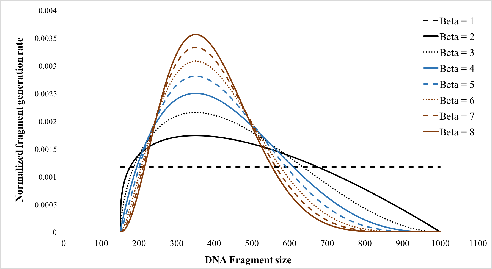

# RadiSeq

This is a tool to simulate Next Generation Sequencing (NGS) of radiation-exposed cells using a Standard DNA Damage (SDD) data file from Monte Carlo simulations of cell irradiations. RadiSeq can perform both bulk- and single-cell whole genome DNA sequencing. 

## Table of Contents

* [Authors](#authors)
* [Description](#description)
* [Features](#features)
* [Installation](#installation)
* [Input Parameters](#input-parameters)
* [Use cases](#use-cases)
* [Acknowledgements](#acknowledgements)

## Authors

Felix Mathew and John Kildea

Contact email: felix.mathew@mail.mcgill.ca

Website: [www.kildealab.com](https://kildealab.com/software/radiseq_simulator/)

## Description
Use RadiSeq to computationally simulate whole genome DNA sequencing of radiation-exposed cells in a sample. The complete working logic is shown in the flowchart below.  

## Features

* All input values can be specified in a single parameter file
* Compatible with any nuclear DNA model that can output an SDD
* Compatible with haploid and homozygous/heterozygous diploid genomes
* Multi-threading enabled 
* Option to switch between single-cell and bulk-cell sequencing
* Option to perform single-end and paired-end sequencing
* 6 built-in Illumina sequencers to choose from with an option to specify custom Illumina sequencer
* Option to model specific DNA fragmentation distribution
* Options to include GC bias model and Multiple Displacement Amplification model
* Users can use any reference genome of their choosing
* Option to generate a detailed run summary output file

## Installation
### Prerequisites

* Compiler: Should support C++17 or above
* OS: Unix-like systems (e.g.: Linux, macOS)

**Note**: This application was developed on Rocky Linux 8.9.

### Getting started

1. Download the latest version of RadiSeq
2. Unzip the downloaded RadiSeq file
3. Download the generic human reference genome [(click here to download)](https://ftp.ensembl.org/pub/grch37/current/fasta/homo_sapiens/dna/Homo_sapiens.GRCh37.dna_rm.primary_assembly.fa.gz) 
   Unzip the downloaded file and save it in the 'radiSeqData' directory under the name `'Human_reference_genome.fa'`.
5. Compile RadiSeq:
   * `cd path/to/RadiSeq`
   * `make` 
   Ignore any warnings that you might see.
6. Set up the environment variable 'RADISEQ_DATA_DIR'
   * `export RADISEQ_DATA_DIR=path/to/RadiSeq/radiSeqData` 
   You will need to do this step every time you open a fresh Terminal window. Alternatively, you may choose to add this into one of your statup files (eg: .bashrc) if you are comfortable doing so. 
**Note**: Replace 'path/to/RadiSeq' in step 5 and 6 with the actual full path to the directory RadiSeq in your system

### Running a test
Run the test sequencing to check if the RadiSeq is working fine. You can run the test using the command:  
* `cd ./example_test`
* `../RadiSeq ./TestParameters.txt`

A successful test run will generate FASTQ output files and a run summary file in a folder called 'output' inside the example_test directory.

**Note**: This test example is using made-up data for the sole purpose of testing if the installation was successful. We advise against using it for any simulation observation. User can create their own [input parameter files](#input-parameters) to run specific simulations 

### Generating custom sequencer profiles
The RadiSeqProfiler program can be used to generate error profiles of custom Illumina sequencers of choice. However, users are expected to have the sequenced read data, obtained using the sequencer they wish to generate the profile for, in .fastq.gz format. For each of the reads in the read pairs, following command can be used to generate the corresponding error profile. 
* `cd path/to/RadiSeq`
* `./RadiSeqProfiler -f <path/to/fastq.gz> -o <outputFile.txt>` 

## Input parameters

The user should specify all the input parameters for the simulation in a parameter text(.txt) file. Users can make any text file a parameter file with a filename
of their choosing, as long as the contents of the file are formatted in a specified parameter name and value pair. Input values can be given in the format:
`Parameter Name = Parameter Value   #comment`. The list of all acceptable parameter names is given in the table below. All the parameters are optional except the path to the SDD file. 

| Parameter name | Description | Parameter value |
|----------|------------|------------|
| sddFilePath | Complete path to the SDD file(s) | Comma separated list of paths (string) |
| merge_damages_from_multiple_particles | Flag to indicate if the user wishes to define a single genome by combining damages from multiple SDD files | 'True' or 'False' |
| number_of_particles_to_merge | Number of SDD files from individual primary simulations to combine | Number (integer) |
| primary_particles_simulated | Names of primary particles that introduced the damages that are going to be combined into a single genome | Comma-separated list of names  (strings) |
| relative_dose_contributions | Relative dose contributions of each primary particle in order of the SDD files | Comma-separated list of numbers between 0 and 1 (double(s)) |
| adjust_damages_with_actual_dose | Flag to indicate if the user wishes to scale the number of damages with the actual dose delivered and it is different from the expected dose | 'True' or 'False' |
| actual_dose_delivered_data | Complete path to the file containing the actual dose delivered in each run. One file is expected for each SDD file specified | Comma-separated list of paths (string) |
| reference_genome_FASTAfile | Complete path to the reference genome file | path to file (sting) |
| acceptable_difference_in_seq_length_percent | Acceptable difference in the lengths of the reference genome provided and the genome length of the Monte Carlo model | Percentage (double) |
| number_of_cells_in_sample | Total number of cells the user assumes to have in your sample. This is different from the number of cells to sequence | Number (integer) |
| number_of_cells_to_sequence | Number of cells (damaged and undamaged) to be sequenced. These many cells will be randomly selected from the number of cells in the sample | Number (integer) |
| illumina_sequencer | Name of the Illumina sequencer to be used for sequencing from the in-built list | 'HiSeq1000', 'HiSeq2000', 'HiSeq2500_v125', 'HiSeq2500_v150', 'HiSeqX', 'NovaSeq6000' and 'Custom' |
| custom_read1_quality_profile_path | Complete path to the read 1 quality profile file when custom sequencer is chosen | path to file (string) |
| custom_read2_quality_profile_path | Complete path to the read 2 quality profile file when custom sequencer is chosen and paired-end sequencing is needed | path to file (string) |
| single_or_bulk_sequencing | Flag to specify if single-cell or bulk-cell sequencing is to be performed | 'single' or 'bulk' |
| do_paired_end_sequencing | Flag to indicate if paired-end sequencing to be performed | 'True' or 'False' |
| fraction_of_other_oriented_read_pairs | The fraction of read pairs needs to be in orientations other than forward-reverse (FR) | Number in the range [0,1] (double) |
| fragment_size_distribution_path | Complete path to the text (.txt) file that stores the fragment size distribution | Path to file (string) |
| min_DNA_fragment_length | Minimum DNA fragment length (in bp) to be generated if paired-end sequencing | Number (integer) |
| max_DNA_fragment_length | Maximum DNA fragment length (in bp) to be generated if paired-end sequencing | Number (integer) |
| mode_DNA_fragment_length | Mode DNA fragment length (in bp) to be generated if paired-end sequencing | Number (integer) |
| beta_of_beta_distribution | Beta parameter value for the beta distribution that will be used to represent the fragment size distribution | Number (double) |
| read_length | Length of the read (in bp) to be generated | Number (integer) |
| total_read_coverage | Total read coverage the user wants to get from this sequencing. If single-cell sequencing the read coverage will get distributed over the total number of cells sequenced | Number (integer) |
| coverage_distribution | Read coverage distribution mode to be used in single-cell sequencing | 'Uniform' or be 'MDA' |
| degree_of_GC_bias | Slope of the linear portions of the triangular function used for GC bias | Number (double) |
| bin_size_for_GC_bias_estimation | The bin size to be used to calculate the GC fraction and bias | Number (integer) |
| read1_insertion_error_rate | Insertion error rate for read 1. Expects a double value between 0 and 1 | Number (double) |
| read1_deletion_error_rate | Deletion error rate for read 1. Expects a double value between 0 and 1 | Number (double) |
| read2_insertion_error_rate | Insertion error rate for read 2. Expects a double value between 0 and 1 | Number (double) |
| read2_deletion_error_rate | Deletion error rate for read 2. Expects a double value between 0 and 1 | Number (double) |
| read_artifacts_rate | The rate of chimera artifact formation in read 1 and 2 combined | Number in the range [0,1] (double) |
| output_directory_path | Complete path to the directory where the output fastq files and the run summary file should be stored | Path to directory (string) |
| output_FASTQ_filename_prefix | Prefix for the sequenced output FASTQ file (omit file extension) | String |
| make_summary_report | Flag to indicate if the user wishes to generate a summary report file at the end of run | 'True' or 'False' |
| random_seed | Seed number for the random number generator to be initialized with a fixed seed. A default value of 0 indicates that the system will automatically generate random seeds completely random | Number (integer) |
| number_of_threads | Number of threads to be used for a multithreaded run. Default value is 1 | Number (integer) |

## Use cases

### 1. Using multiple SDD files to combine damages from multiple radiation exposures
If a single-cell MC model is irradiated under the same conditions, the damages from these repeated irradiations will be stored in a same SDD file with a single header section. When such an SDD file is provided as an input to RadiSeq, each of the repeated irradiation will generate a uniquely damaged single cell genome for sequencing. Therefore, if one wants more damaged cells to be sequenced, make sure the SDD file provided has as many irradiation simulations as needed.  
If a single-cell MC model is irradiated with two different radiation qualities (say electron and proton for example) and there are two SDD files corresponding to the two exposures, each with say 100 damaged cell data, RadiSeq provides the option to combine the damages from both electron and proton in a cell using the input parameter flag 'merge_damages_from_multiple_particles'. Then user must also provide 'number_of_particles_to_merge' (it is 2 in this example), and optionally provide the names of these 'primary_particles_simulated' (electron and proton in this example), and their relative dose contributions as a comma seperated list (ex: 0.4,0.6). This will generate 100 damaged cell genomes with damages coming from electron irradiation and from proton irradiation each contributing 40% and 60% of the total dose to the cells respectively.  
**Note**: If the number of repeated irradiations in the two SDD files are not the same, then RadiSeq will only merge the least common number of cell damage data in both SDD files.

### 2. Compensating for additional dosage in irradiation than desired
Monte Carlo simulation of cell irradiation may deliver a higher dose to the cell model than what is specified in the irradiation simulation since the dose each radiation track will deposit is descrete. This phenomenon is more prenounced when the irradiated dose is small. However, RadiSeq provides the option for the user to compensate for additional dose and for that the user can set the input parameter flag 'adjust_damages_with_actual_dose'. However, if the flag is set to be 'true', then the user must also provide the path to a text file that has the information about the actual dose that was delivered as the input parameter: 'actual_dose_delivered_data'. For example, if you have an SDD file with 100 repeated irradiations that were supposed to deliver 1 Gy dose in each irradiation but exceeded this value, then you can compensate for this by providing a text file with 100 rows of data (each row corresponding to the actual dose delivered in the respective repeated irradiation).

### 3. Simulating sequencing of sham-irradiated control samples
RadiSeq expect an SDD file as a required paramter in every simulation. And that is true even if the user wishes to simulate sequencing of un-irradiated/sham-irradiated cell samples. The way around to perform such simulation is to use a dummy SDD file with the header data corresponding to the cell model but with empty data fields. A sham-irradiated human cell sample generated using the NICE model can be obtained from `./radiSeqData/SDDOutput_0GY.txt`.

### 4. Simulating an Illumina sequencer that is not in the in-built sequencer list
RadiSeq comes with 6 Illumina sequencer models built-in. It also has the capability to extend this if the user wishes to simulate other Illumina sequencers with the 'Custom' option for the input parameter: 'illumina_sequencer'. However, user will have to provide their own read quality profiles for the sequencer they want to simulate. The paths to the files containing the read quality profile of read 1 and read 2 (if paired-end sequencing) is expected for the parameters 'custom_read1_quality_profile_path' and 'custom_read2_quality_profile_path' respectively. The [ART_profiler_illumina tool](https://www.niehs.nih.gov/research/resources/software/biostatistics/art/index.cfm) from the ART toolkit can be used to generate compatible quality profiles.
**Note**: Make sure the read length requested with the custom sequencer does not exceed the maximum acceptable limit compatible with the custom quality profile provided. Read lengths longer than the compatible limit will crash the simulation.  

### 5. Modifying DNA fragment size distribution in paired-end sequencing
The DNA fragment size distribution is modelled as a beta distribution in RadiSeq. Users can modify the fragment size distribution using the four input parameters: 'min_DNA_fragment_length', 'max_DNA_fragment_length', 'mode_DNA_fragment_length' and 'beta_of_beta_distribution'. As the name suggests, these parameters control the minimum, maximum, mode and beta values of the beta distribution respectively. While minimum and maximum values defines the range of the generated DNA fragment lengths, mode and beta values dictate the shape of the fragment size distribution. Below here is an example showing the effect of different beta values on the distribution for a minimum fragment length of 150bp, maximum fragment length of 1000bp and a mode of 350bp.  

### 6. Enabling GC bias model
A unimodal distribution is desirable for GC bias in sequencing. i.e, both genomic regions with higher GC content (GC-rich) and lower GC content (AT-rich) are expected to be sampled less than a region that has more balanced GC content. RadiSeq uses a combination of two linear models to form a triangular distribution as an approximation of the underlying GC bias in a simulation. Users can control the degree of this bias using the input parameter called 'degree_of_GC_bias'. This parameter specifies the slope of the linear models. By default a slope of 0 is used in RadiSeq. If GC bias model needs to be enable, one should specify a degree_of_GC_bias higher than 0. Higher the degree of bias, higher the slope and hence we get higher GC bias. GC bias is calculated over a sliding window of size equal to the read length.
**Note**: The simulation will take longer with increasing bias. 

## Acknowledgements

Some of the in-built Illumina sequencer error profiles and the read generation method used in the RadiSeq were adopted from the ART Illumina sequencing tool published open-source by the US National Institute of Health. We sincerely thank the authors Weichun Huang et al. for making the ART toolkit available open-source as well as the developers of other open-source sequencing software.

To learn more about the ART toolkit:

* Publication: Weichun Huang and others, ART: a next-generation sequencing read simulator, Bioinformatics, Volume 28, Issue 4, February 2012, Pages 593–594, https://doi.org/10.1093/bioinformatics/btr708
* ART toolkit: https://www.niehs.nih.gov/research/resources/software/biostatistics/art/index.cfm
* GitHub: https://github.com/scchess/Art/tree/master

